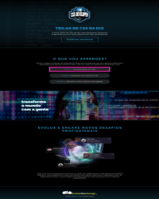

# ⭐ Desafio: Criando sua primeira Landing Page com HTML e CSS.

🎉 Bem-vindo ao repositório do projeto "1ª Landing Page"!

Este projeto foi desenvolvido como parte da imersão em CSS da Digital Innovation One. Aqui, você encontrará o código-fonte, instruções de uso e informações adicionais para ajudar você a entender este projeto.

>**Colaboração:** [@emilycordeiro0](https://github.com/emilycordeiro0). 
>**Status:** Concluído. ✔️ 

  
👀 Prévia:

  

<a style="color: aqua;" href="https://igorenatoo.github.io/HTCS-DIO-LandingPage/">🔗 Acesse aqui o projeto finalizado!</a>

## Índice

- [Descrição](#descrição)
- [Tecnologias Utilizadas](#tecnologias-utilizadas)
- [Protótipo no Figma](#protótipo-no-figma)
- [Instalação](#instalação)
- [Uso](#uso)
- [Contribuição](#contribuição)
- [Licença](#licença)
- [Recursos Adicionais](#recursos-adicionais)

## Descrição

Este projeto prático foi criado para ajudar os desenvolvedores a entender e aplicar conceitos de CSS aprendidos durante a imersão. A ideia é replicar o projeto original, criando um repositório próprio e aumentando seu portfólio de projetos no GitHub.

[⬆️](#índice)

## Tecnologias Utilizadas

- HTML
- CSS
- <a style="color: aqua" href="https://www.figma.com">Figma</a>

[⬆️](#índice)

## Protótipo no Figma

O protótipo utilizado para este projeto está disponível no Figma. Você pode acessá-lo no seguinte link.

🔗 <a style="color: aqua" href="https://www.figma.com/file/3PiokoJj9IhGDnNiWAJbz7/DIO---Desafio-01?node-id=0%3A1">Protótipo no Figma</a>

[⬆️](#índice)

## Instalação
Para começar a usar este projeto, siga as etapas abaixo:

1. Clone o repositório:
<pre>git clone https://github.com/IgoRenatoo/HTCS-DIO-LandingPage</pre>

2. Acesse o diretório do projeto:
<pre>cd htcs-dio-landingpage</pre>

3. Execute o projeto:
<pre>code .</pre>

4. Abra o arquivo index.html em seu navegador preferido.

[⬆️](#índice)

## Uso
Para visualizar o projeto, abra o arquivo index.html em seu navegador. Certifique-se de que todos os arquivos CSS e JavaScript estejam no diretório correto para garantir que o projeto funcione como esperado.

[⬆️](#índice)

## Contribuição
Contribuições são bem-vindas! Se você deseja contribuir com este projeto, siga as etapas abaixo:

1. Faça um fork deste repositório.
1. Crie uma branch para sua feature ou correção de bug ( `git checkout -b <nome-da-nova-ramificacao>` ).
1. Commit suas alterações ( `git commit -m 'Mensagem desejada'` ).
1. Push para a branch ( `git push origin <nome-da-nova-criada>` ).
1. Abra um Pull Request.

[⬆️](#índice)

## Licença
Este projeto está licenciado sob a Licença MIT.

Use a vontade! 🎉
 
[⬆️](#índice)

## Recursos Adicionais
Repositório Original no GitHub ~> 🔗 <a style="color: aqua" href="https://github.com/digitalinnovationone/trilha-css-desafio-01">Click Aqui!</a>

[⬆️](#índice)

🎆 Bons estudos e boas contribuições!